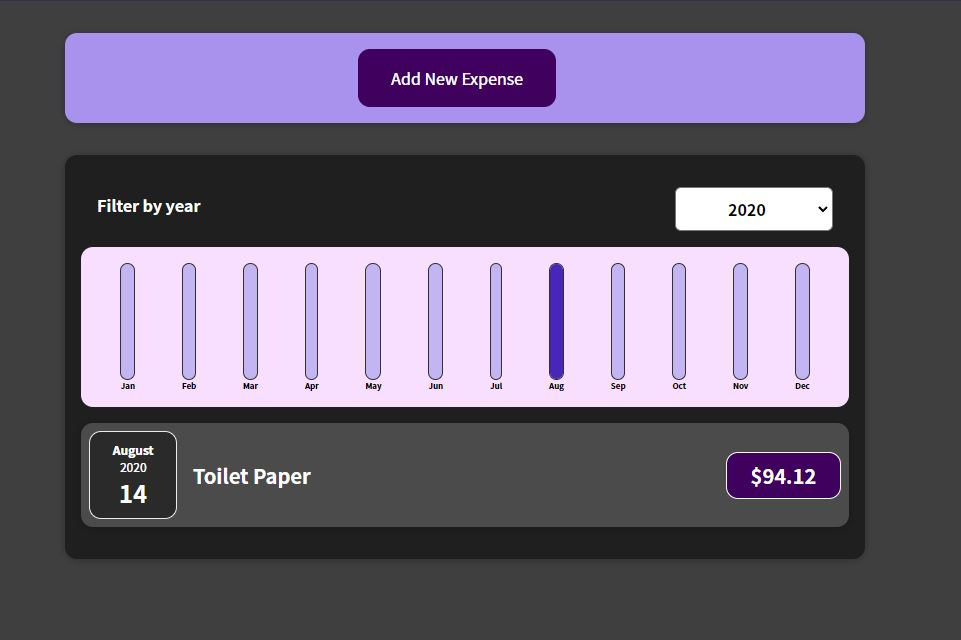
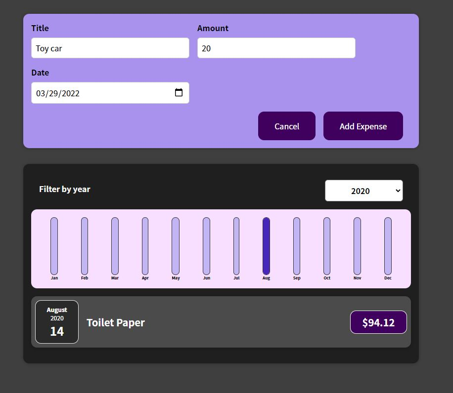
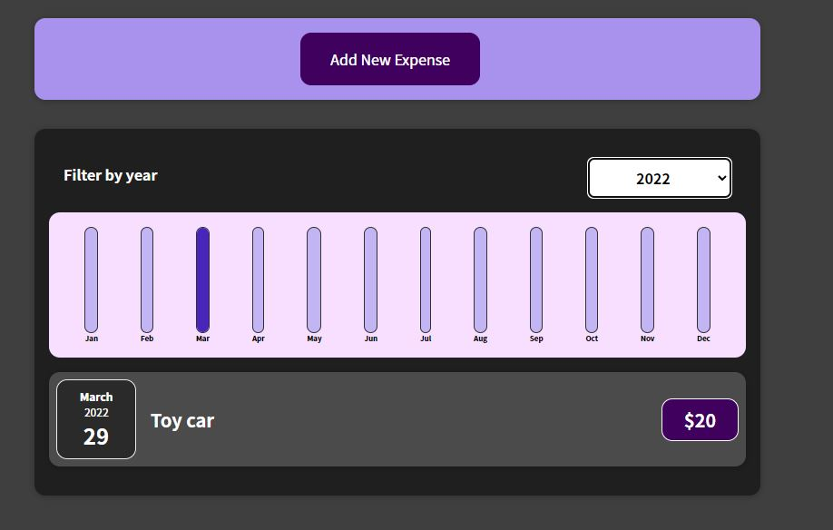

# ExpensesTrackerApp
To view The published app visit :- https://abdulbasit-creator.github.io/ExpensesTrackerApp/

## About The Project
I took 100 days of coding challenge where i am starting from react js and get to my max ability in WEB DEVELOPMENT
This was my first project " Expense Tracker App "  where A person can add there expenses and track them.

# Application Snippets

# 1.

# 2.

# 3.

# Future plans of the project
After i have learnt backend i will try to make a custom user where the data gets saved and the data isnt lost for the user and they can keep the expense track much more effectively.
